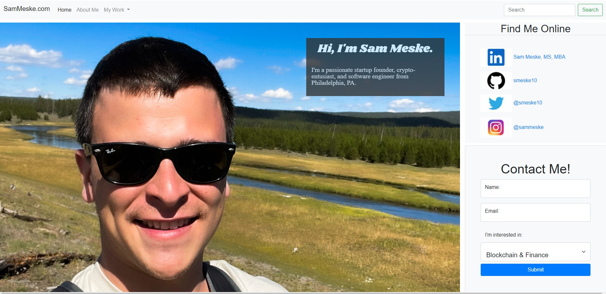

# My Portfolio
This web page is my portfolio. There is a brief About Me section describing my life and my interests. It also outlines my experiences and beliefs in the areas that I work: Software Development, Blockchain, Healthcare, and Research. It also contains links to my online profiles so visitors can find my online presence.

# Acceptance Criteria
- It will be done when:
    - a user can use the navigation bar to find different sections within the document
    - a user comes to the portfolio and sees a banner with an image and contact information
    - a user sees images with valid href to view my work and articles
    - a user is able to scroll thru my CV on the web page
    - a user can use the links in the footer to navigate the page
    - a user can input their contact information and the information is stored

# To Do
- Add content to articles
- Add javascript functionality for transitions/scroll to sections

